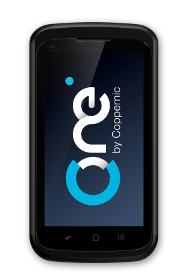
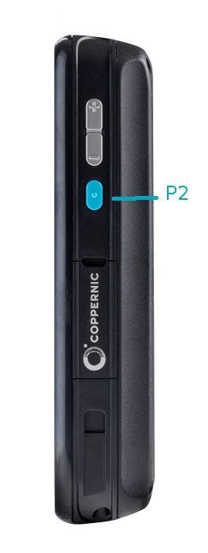
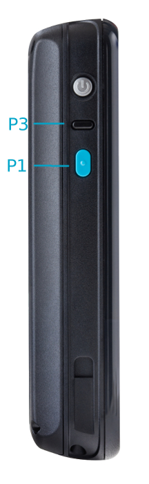

C-One²
======

Specifications
--------------

Full Specifications for C-One² can be downloaded [here](https://www.coppernic.fr/en/documentations/)

Barcode Scanning
----------------

C-One² is equiped with a 2D barcode scanner. It can read both 1D and 2D barcodes.

- [Barcode](barcode/barcode_scan.md)

Key mapping
-----------

C-One² has 3 programmable buttons that can be managed using API. It is possible to remap a virtual key or an application.

 

- [Documentation](core/mapping.md)

RFID
----

- [ASK](products/ask.md)
- [HID](products/hid.md)
- [Agrident](products/agrident.md)
- [Legic](products/legic.md)
